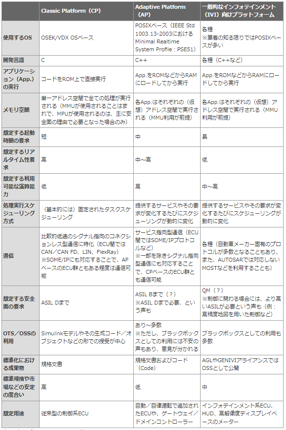
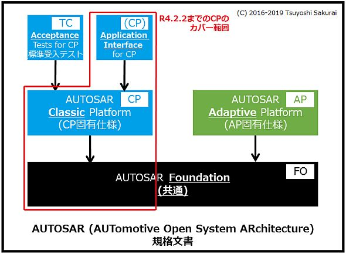

# AUTOSAR

## AUTOSARとは

AUTOSAR (Automotive Open System Architecture)は、欧州の自動車メーカーを中心に策定される車載向けソフトウェアプラットフォームの標準規格です。

> AUTOSARでは、階層化されたソフトウエアアーキテクチャとして車載ソフトウエアのあり方を定義している（図1（b））。各階層で使用するソフトウエアをモジュール化（コンポーネント化）することにより、その再利用が可能になるという仕組みだ。
> [AUTOSARで変わる車載ソフトウエア開発（1/4 ページ） - EDN Japan](https://ednjapan.com/edn/articles/0910/01/news123.html)

なにが嬉しいのか？
車載ECUのプログラム量は年々増加しており、プログラムの再利用性を高めることで効率的な開発を実現することを目的としている。

AUTOSARは大きく2つに分類されます。

|略称|プラットフォーム |用途                |
|----|-----------------|--------------------|
|CP  |Classic Platform |制御システム向け    |
|AP  |Adaptive Platform|自動運転システム向け|

# アーキテクチャ

AUTOSARのソフトウェアアーキテクチャは以下の3つの層から構成される。
- アプリケーション層
- AUTOSARランタイム環境（RTE : Run Time Environmnet）
- 基盤ソフトウェア（BSW : Basic SoftWare）

RTE・・・アプリケーション層内のSW-CとSW-Cとの間、SW-CとBSWの間をつなぐI/Fです。

BSW・・・ハードウェアと車載ソフトウェアをつなぐ階層（OS、ドライバ、ミドルウェアに相当）であり、大まかに以下４層に分類できる。
- サービス層
- ECU抽象化層
- マイクロコントローラ中層化層（MCAL）
- 複合ドライバ
  

# Adaptive Platform

公式仕様書: [Adaptive Platform - AUTOSAR](https://www.autosar.org/standards/adaptive-platform/)

AUTOSAR Adaptive PlatformはARA（AUTOSAR Runtime for Adaptive Application）を実装する。サービスとAPIの2つのI/Fが利用可能。プラットフォームは、サービスとAdaptive AUTOSAR Basisにグループ化されたFunctional clustersで構成される。

## APが登場したわけ

運転支援 / 自動運転機能を量産車に導入するために登場しました。
主には以下の４つが求められます。

- コネクティビティ(Connectivity)
- ハイパフォーマンスコンピューティング(HPC)
- オフザシェルフ/オープンソース(OTS/OSS)
- 安全性（Safety）

もう一点重要なポイントとして、
- 他分野の世界標準な技術（POSIX API, DDS, SOME/IPなど）を取り入れたこと
- CPとはある程度の独立した開発や、アジャイル開発の採用といった体制に対応

車載システム向けサービス指向通信ミドルウェア SOME/IP(Scalable Service-Oriented MiddlewarE over IP)
SOME/IPはCPにも採用されている
Pub/Sub通信とRPC（Remote Procedure Call）に対応
[次世代車載向け通信プロトコルSOME/IPとDDSの性能評価](https://ipsj.ixsq.nii.ac.jp/ej/index.php?active_action=repository_view_main_item_detail&page_id=13&block_id=8&item_id=186427&item_no=1)

CP ・・・ハードリアルタイム性・安全性を重視

[AUTOSAR Adaptive Platformとは？：AUTOSARを使いこなす（7）（2/3 ページ） - MONOist](https://monoist.itmedia.co.jp/mn/articles/1902/05/news006_2.html)

仕様書の略書の意味

|略称|意味|
|----|----|
|EXP |Explanation|
|PRS |Protocol Specification|
|TPS | |
|SWS |Software Specification|
|RS  |Requirements|
|UDS |Unified Diagnostic Services|

