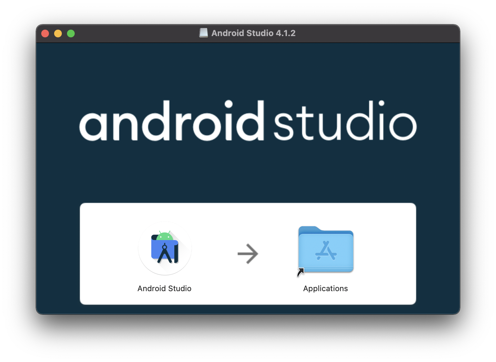
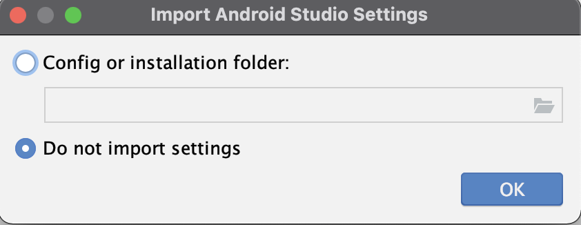
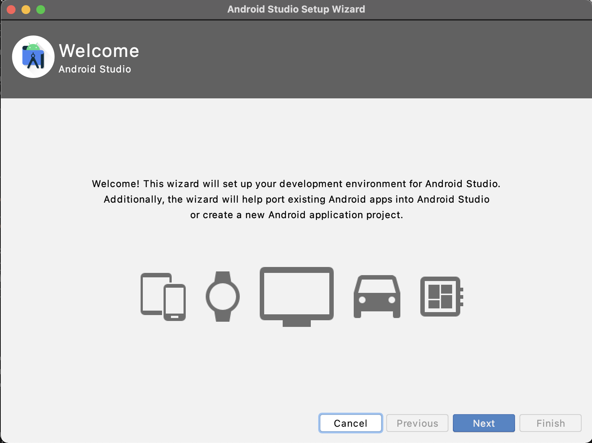
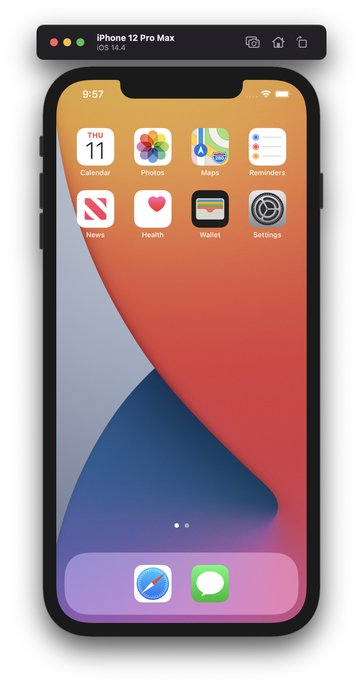

# Flutter Setup


<!-- @import "[TOC]" {cmd="toc" depthFrom=1 depthTo=6 orderedList=false} -->

<!-- code_chunk_output -->

- [Flutter Setup](#flutter-setup)
  - [Reference web sites](#reference-web-sites)
  - [Install](#install)
    - [Install for M1 Mac](#install-for-m1-mac)
    - [Run flutter doctor](#run-flutter-doctor)
    - [Seting environment](#seting-environment)
    - [Run flutter doctor again](#run-flutter-doctor-again)
  - [Set up the iOS simulator](#set-up-the-ios-simulator)
  - [Create and run sample app](#create-and-run-sample-app)
  - [Run on the web](#run-on-the-web)
  - [Format Code with dart-format](#format-code-with-dart-format)

<!-- /code_chunk_output -->


## Reference web sites

- [Flutter環境構築 Mac M1 (Apple Silicon) 版](https://zenn.dev/hndr/articles/14689ec937af1f)

## Install

- [Install - Flutter](https://flutter.dev/docs/get-started/install)
    - [macOS install - Flutter](https://flutter.dev/docs/get-started/install/macos)

### Install for M1 Mac

```bash
$ sw_vers
ProductName:	macOS
ProductVersion:	11.1
BuildVersion:	20C69
```

公式のインストール方法の手順通りにやってみる。

```diff
$ cd ~/Dev/lib
$ unzip ~/Downloads/flutter_macos_1.22.6-stable.zip

$ vim ~/.zshrc
+ export PATH="$PATH:<your path>/flutter/bin"

$ source ~/.zshrc
```

### Run flutter doctor

`flutter doctor`を実行すると、開発環境の状態をチェックして表示してくれます。
Dart SDKはバンドルされているので、個別にインストール必要はないので便利。
ここで整っていないと言われた環境を整えていきます。

```bash
$ flutter doctor
Downloading Dart SDK from Flutter engine 2f0af3715217a0c2ada72c717d4ed9178d68f6ed...
  % Total    % Received % Xferd  Average Speed   Time    Time     Time  Current
                                 Dload  Upload   Total   Spent    Left  Speed
100  172M  100  172M    0     0  30.3M      0  0:00:05  0:00:05 --:--:-- 31.6M
Building flutter tool...

  ╔════════════════════════════════════════════════════════════════════════════╗
  ║                 Welcome to Flutter! - https://flutter.dev                  ║
  ║                                                                            ║
  ║ The Flutter tool uses Google Analytics to anonymously report feature usage ║
  ║ statistics and basic crash reports. This data is used to help improve      ║
  ║ Flutter tools over time.                                                   ║
  ║                                                                            ║
  ║ Flutter tool analytics are not sent on the very first run. To disable      ║
  ║ reporting, type 'flutter config --no-analytics'. To display the current    ║
  ║ setting, type 'flutter config'. If you opt out of analytics, an opt-out    ║
  ║ event will be sent, and then no further information will be sent by the    ║
  ║ Flutter tool.                                                              ║
  ║                                                                            ║
  ║ By downloading the Flutter SDK, you agree to the Google Terms of Service.  ║
  ║ Note: The Google Privacy Policy describes how data is handled in this      ║
  ║ service.                                                                   ║
  ║                                                                            ║
  ║ Moreover, Flutter includes the Dart SDK, which may send usage metrics and  ║
  ║ crash reports to Google.                                                   ║
  ║                                                                            ║
  ║ Read about data we send with crash reports:                                ║
  ║ https://flutter.dev/docs/reference/crash-reporting                         ║
  ║                                                                            ║
  ║ See Google's privacy policy:                                               ║
  ║ https://policies.google.com/privacy                                        ║
  ╚════════════════════════════════════════════════════════════════════════════╝


Downloading Material fonts...                                       0.5s
Downloading Gradle Wrapper...                                       0.2s
Downloading package sky_engine...                                   0.2s
Downloading flutter_patched_sdk tools...                            0.7s
Downloading flutter_patched_sdk_product tools...                    0.5s
Downloading darwin-x64 tools...                                     1.2s
Downloading libimobiledevice...                                     0.0s
Downloading usbmuxd...                                              0.0s
Downloading libplist...                                             0.0s
Downloading openssl...                                              0.1s
Downloading ios-deploy...                                           0.0s
Downloading darwin-x64/font-subset tools...                         0.1s
Downloading android-arm-profile/darwin-x64 tools...                 0.2s
Downloading android-arm-release/darwin-x64 tools...                 0.3s
Downloading android-arm64-profile/darwin-x64 tools...               0.3s
Downloading android-arm64-release/darwin-x64 tools...               0.2s
Downloading android-x64-profile/darwin-x64 tools...                 0.3s
Downloading android-x64-release/darwin-x64 tools...                 0.3s
Doctor summary (to see all details, run flutter doctor -v):
[✓] Flutter (Channel stable, 1.22.6, on macOS 11.1 20C69 darwin-arm, locale ja-JP)
[✗] Android toolchain - develop for Android devices
    ✗ Unable to locate Android SDK.
      Install Android Studio from: https://developer.android.com/studio/index.html
      On first launch it will assist you in installing the Android SDK components.
      (or visit https://flutter.dev/docs/get-started/install/macos#android-setup for detailed instructions).
      If the Android SDK has been installed to a custom location, set ANDROID_SDK_ROOT to that location.
      You may also want to add it to your PATH environment variable.

[✗] Xcode - develop for iOS and macOS
    ✗ Xcode installation is incomplete; a full installation is necessary for iOS development.
      Download at: https://developer.apple.com/xcode/download/
      Or install Xcode via the App Store.
      Once installed, run:
        sudo xcode-select --switch /Applications/Xcode.app/Contents/Developer
        sudo xcodebuild -runFirstLaunch
    ✗ CocoaPods not installed.
        CocoaPods is used to retrieve the iOS and macOS platform side's plugin code that responds to your plugin usage
        on the Dart side.
        Without CocoaPods, plugins will not work on iOS or macOS.
        For more info, see https://flutter.dev/platform-plugins
      To install:
        sudo gem install cocoapods
[!] Android Studio (not installed)
[!] VS Code (version 1.52.1)
    ✗ Flutter extension not installed; install from
      https://marketplace.visualstudio.com/items?itemName=Dart-Code.flutter
[!] Connected device
    ! No devices available

! Doctor found issues in 5 categories.
```

### Seting environment

`flutter doctor`で足りないと言われた環境を整えていきます。

- Android SDK

```bash
[✗] Android toolchain - develop for Android devices
    ✗ Unable to locate Android SDK.
      Install Android Studio from: https://developer.android.com/studio/index.html
      On first launch it will assist you in installing the Android SDK components.
      (or visit https://flutter.dev/docs/get-started/install/macos#android-setup for detailed instructions).
      If the Android SDK has been installed to a custom location, set ANDROID_SDK_ROOT to that location.
      You may also want to add it to your PATH environment variable.
```

公式のインストール方法については、[Android Studio install for Mac](https://developer.android.com/studio/install#mac)を参照

1. [Download Android Studio and SDK tools  |  Android Developers](https://developer.android.com/studio)にアクセス
1. `DOWNLOAD ANDROID STUDIO`から.dmgファイルをダウンロード
1. ダウンロードした.dmgファイルを実行
1. 以下の画面になったらDrug＆Dropし、Andriod Studioを起動

1. 初回なので以前の設定をインポートしないを選択





Intel CPUじゃないとHAXM11がインストールされないだと…。M1 Maxにまだ人権はない模様。
調べてみると"現時点ではAndroid EmulatorはM1では動作しない”とのことだが、まぁ、それ以外は問題ないようなのでよしとする。

```bash
Android SDK is up to date.
Unable to install Intel® HAXM
Your CPU does not support VT-x.
Unfortunately, your computer does not support hardware accelerated virtualization.
Here are some of your options:
 1) Use a physical device for testing
 2) Develop on a Windows/OSX computer with an Intel processor that supports VT-x and NX
 3) Develop on a Linux computer that supports VT-x or SVM
 4) Use an Android Virtual Device based on an ARM system image
   (This is 10x slower than hardware accelerated virtualization)
Creating Android virtual device
Android virtual device Pixel_3a_API_30_x86 was successfully created
```

- Xcode

```
[✗] Xcode - develop for iOS and macOS
    ✗ Xcode installation is incomplete; a full installation is necessary for iOS development.
      Download at: https://developer.apple.com/xcode/download/
      Or install Xcode via the App Store.
      Once installed, run:
        sudo xcode-select --switch /Applications/Xcode.app/Contents/Developer
        sudo xcodebuild -runFirstLaunch
    ✗ CocoaPods not installed.
        CocoaPods is used to retrieve the iOS and macOS platform side's plugin code that responds to your plugin usage
        on the Dart side.
        Without CocoaPods, plugins will not work on iOS or macOS.
        For more info, see https://flutter.dev/platform-plugins
      To install:
        sudo gem install cocoapods
```

1. Apple StoreからXcodeのアプリをインストール
1. 以下のコマンドを実行

```
$ sudo xcode-select --switch /Applications/Xcode.app/Contents/Developer
$ udo xcodebuild -runFirstLaunch
```

- **CocoaPods**

```bash
$ exec arch -x86_64 /bin/zsh
$ sudo gem install ffi
$ sudo gem install cocoapods
```

`ffi`をgemインストールしておくとcocoapods インストール時のffiのエラーが回避できるようです。

### Run flutter doctor again

これで問題の箇所( [x] )は解消できました。必須ではないですが、[ ! ]箇所もできるだけ解消しておこうと思います。

```bash
$ flutter doctor
Doctor summary (to see all details, run flutter doctor -v):
[✓] Flutter (Channel stable, 1.22.6, on macOS 11.1 20C69 darwin-arm, locale ja-JP)
 
[!] Android toolchain - develop for Android devices (Android SDK version 30.0.3)
    ✗ Android licenses not accepted.  To resolve this, run: flutter doctor --android-licenses
[✓] Xcode - develop for iOS and macOS (Xcode 12.4)
[!] Android Studio (version 4.1)
    ✗ Flutter plugin not installed; this adds Flutter specific functionality.
    ✗ Dart plugin not installed; this adds Dart specific functionality.
[!] VS Code (version 1.52.1)
    ✗ Flutter extension not installed; install from
      https://marketplace.visualstudio.com/items?itemName=Dart-Code.flutter
[!] Connected device
    ! No devices available

! Doctor found issues in 4 categories.
```

- Android SDKのライセンス認証

```bash
$ flutter doctor --android-licenses
# 質問には全てy(yes)で回答して問題ないです。
```

- Android Studio

これはM1 Mac以外でも出ている事象らしく下記Issueに対処方法が載っているので対応します。

[Flutter Doctor: Android Studio 4.1 is not detected · Issue #67986 · flutter/flutter](https://github.com/flutter/flutter/issues/67986#issuecomment-715118389)

```bash
$ ln -s ~/Library/Application\ Support/Google/AndroidStudio4.1/plugins ~/Library/Application\ Support/AndroidStudio4.1
```

- VS Code

私は普段からVScodeを利用しているのでFlutter extensnionはもちろんインストールします。

**再度確認**

```bash
$ flutter doctor
Doctor summary (to see all details, run flutter doctor -v):
[✓] Flutter (Channel stable, 1.22.6, on macOS 11.1 20C69 darwin-arm, locale ja-JP)
 
[✓] Android toolchain - develop for Android devices (Android SDK version 30.0.3)
[✓] Xcode - develop for iOS and macOS (Xcode 12.4)
[!] Android Studio (version 4.1)
    ✗ Flutter plugin not installed; this adds Flutter specific functionality.
    ✗ Dart plugin not installed; this adds Dart specific functionality.
[✓] VS Code (version 1.52.1)
[!] Connected device
    ! No devices available

! Doctor found issues in 2 categories.
```

Android Studioのエラーは消えてないけど、放置しておいても問題はなさそうなので一旦OKということにします。
以上でFlutterのインストール及び環境設定は完了です。

---

## Set up the iOS simulator 

```
$ open -a Simulator
```



## Create and run sample app

```bash
$ flutter create my_app
$ cd my_app
$ flutter run
```

## Run on the web

webアプリとして実行できるようにコンパイルできるようにするには、以下のコマンドでconfigを変更します。一度実行すれば、以降のアプリについてもWbサポートされるようになるようです。
※現時点ではbeta版のようです。

```bash
$ flutter channel beta
$ flutter upgrade
$ flutter config --enable-web
```

**有効化の確認**

`flutter config`コマンドで`ebnable-web`の項目が`true`となっていれば有効化されています。

```bash
$ flutter config
<--略-->
Settings:
  enable-web: true
```

## Format Code with dart-format

```bash
# Terminal
$ flutter format <filename>
```