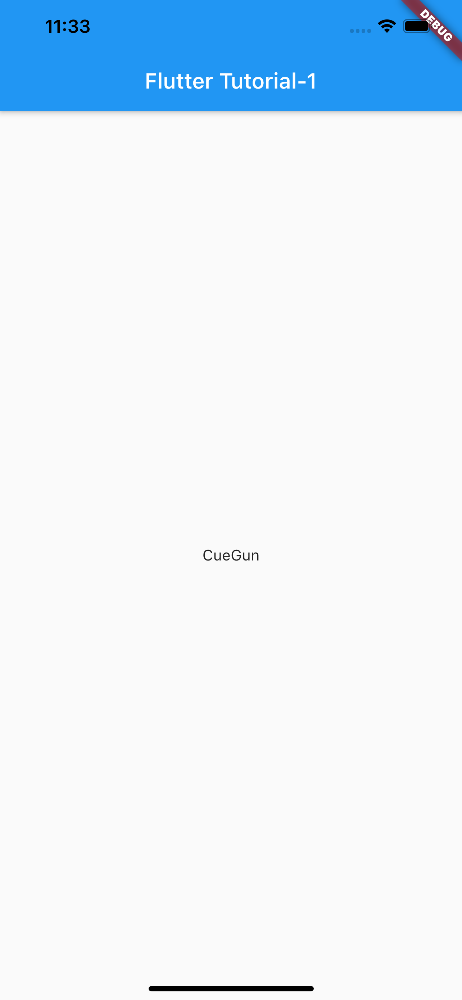

# Flutter Tutorial #1


<!-- @import "[TOC]" {cmd="toc" depthFrom=1 depthTo=6 orderedList=false} -->

<!-- code_chunk_output -->

- [Flutter Tutorial #1](#flutter-tutorial-1)
  - [サンプルを動かしてみる](#サンプルを動かしてみる)
  - [表示される内容を変更してみる](#表示される内容を変更してみる)
  - [Part1](#part1)
    - [Step1](#step1)
    - [Step2](#step2)
    - [Step3](#step3)
    - [Step4](#step4)
  - [Iconsを利用してみる](#iconsを利用してみる)
  - [Flutter's build modes](#flutters-build-modes)
    - [Assertion](#assertion)
    - [Icon list](#icon-list)

<!-- /code_chunk_output -->


## サンプルを動かしてみる

```bash
$ flutter create hoge_app
$ cd hoge_app

$ open -a Simulator

$ flutter run
``` 

<!-- Simulator image -->
 

## 表示される内容を変更してみる

Simulatorを起動した状態で、ソースを編集してターミナルで`r`をタイプするとHot reload（変更が即時反映）されます。

```diff
$ vim lib/main.dart
- 'You have pushed the button this many times:',
+ 'You have "clicked" the button this many times:',

$ r
```

## Part1

[Write your first Flutter app, part 1 - Flutter](https://flutter.dev/docs/get-started/codelab)

> What you’ll learn in part 1
> - How to write a Flutter app that looks natural on iOS, Android, and the web
> - Basic structure of a Flutter app
> - Finding and using packages to extend functionality
> - Using hot reload for a quicker development cycle
> - How to implement a stateful widget
> - How to create an infinite, lazily loaded list

### Step1

基本形のmainファイルを記述する。
タイトルと画面中央に文字列が表示されるだけのプログラムになります。

```dart
// ./lib/main.dart
import 'package:flutter/material.dart';

void main() => runApp(MyApp());

class MyApp extends StatelessWidget {
  // This widget is the root of your application.
  @override
  Widget build(BuildContext context) {
    return MaterialApp(
      title: 'Flutter Tutorial-1',
      home: Scaffold(
        appBar: AppBar(
          title: Text('Flutter Tutorial-1'),
        ),
        body: Center(
          child: Text('Hello Flutter!'),
        ),
      ),
    );
  }
}
```

- `StatelessWidget`: アプリ自体をwigetにする。
- `Sacaffold`: MaterialライブラリのScaffoldウィジェットは、デフォルトのアプリバーと、ホーム画面のウィジェットツリーを保持するbodyプロパティを提供してくれます。

### Step2

Step2では、[english_words](https://pub.dev/packages/english_words)というよく使われる英単語や機能を提供するOSSを利用してみる。
Flutterで利用できるパッケージは[pub.dev](https://pub.dev/)から探すことができる。

1. `pubspec.yaml`ファイルを以下のように変更

```diff
# pubspec.yaml
...
dependencies:
  flutter:            
    sdk: flutter            
  cupertino_icons: ^0.1.2            
+ english_words: ^3.1.5
...
```

2. プロジェクトに`pubspec.yaml`の`dependencies`に記載したパッケージをインストール

```bash
$ flutter pub get
Running "flutter pub get" in startup_namer...                       4.8s
```

3. `lib/main.dart`でパッケージをimportする

```diff
# lib/main.dart
+ import 'package:english_words/english_words.dart';
```

4. `english_words`を使ってランダムな単語を表示してみる

```diff
# lib/main.dart
+ final wordPair = WordPair.random();
...
- child: Text('Hello World'),
+ child: Text(wordPair.asPascalCase),
```

5. Simulatorで起動

`Hot Reroad`する度に表示される単語が切り替わります。randonで設定しているので。

```bash
$ open -a Simulator
$ flutter run
$ r
``` 




### Step3

`Stateless`なウィジットはimmutable(不変)であり、プロパティを変更することができません。全ての値が`final`になるためです。
一方で`Stateful`なウィジェットは変更可能になります。

- StatefulWidget class
- State class

### Step4

無限スクロール機能を実装してみる。


<!-- ############################### -->
---
<!-- ############################### -->

## Iconsを利用してみる

[Icons - Material Design](https://material.io/resources/icons/?style=baseline)

## Flutter's build modes

アプリをコンパイルするときFlutterは3つのモードをサポートしている。
\+ テスト用のheadlessモード。
デフォルト(`flutter run`)では、debugモードでコンパイルされます。


|Mode|Command|Descriptions|
|----|-------|------------|
|[debugモード](https://flutter.dev/docs/testing/build-modes#debug)| `flutter run`|Hot reloadを使用したいとき。<br> EmulatorやSimulatorで実行したいとき。|
|[profileモード](https://flutter.dev/docs/testing/build-modes#profile)|`flutter run -profile`|実際のデバイスで性能評価したいとき。|
|[releaseモード](https://flutter.dev/docs/testing/build-modes#release)|`flutter run release`|アプリのリリース準備をしたいとき。|

### Assertion

- debugモードで有効化されるデバッグ用の確認コマンド
- 条件が満たされない場合、エラーを吐く

```dart
// i.g assert
int a = 2;
asset(a == 1);
```

### Icon list

[Icons class - material library - Dart API](https://api.flutter.dev/flutter/material/Icons-class.html)