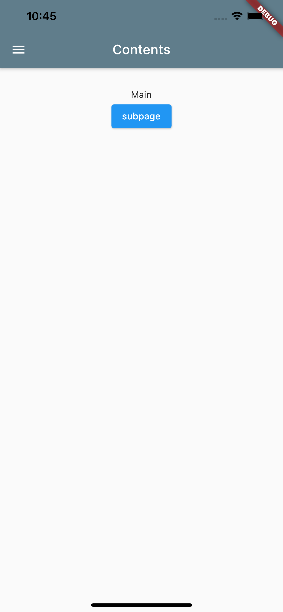
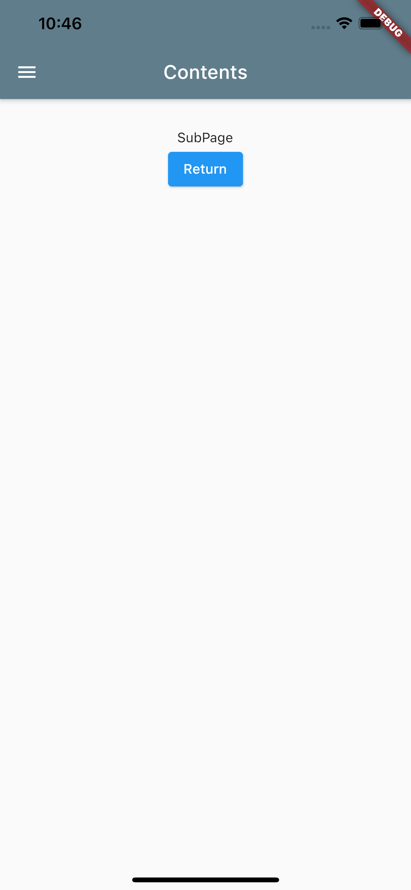

<!-- @import "[TOC]" {cmd="toc" depthFrom=1 depthTo=6 orderedList=false} -->

<!-- code_chunk_output -->

- [Navigator : 画面遷移](#navigator-画面遷移)
  - [Navigator.of(context).pushNamed](#navigatorofcontextpushnamed)
  - [Navigator.of(context).pushReplacementNamed](#navigatorofcontextpushreplacementnamed)
  - [Navigator.popUntil(context, ModalRoute.withName("/home”))](#navigatorpopuntilcontext-modalroutewithnamehome)
  - [Navigator.pushNamedAndRemoveUntil](#navigatorpushnamedandremoveuntil)
- [SideMenuを作成する](#sidemenuを作成する)
- [Appendix](#appendix)
      - [Scaffoldとは](#scaffoldとは)
      - [StatefulWidgetに引数を渡す](#statefulwidgetに引数を渡す)

<!-- /code_chunk_output -->


# Navigator : 画面遷移

ボタンやリンクを選択して他の画面に遷移する機能を実装しながらNavigator機能を学んでいきます。アプリ開発には必須の機能ですね。

[画面遷移(Navigator) | Flutter Doc JP](https://flutter.ctrnost.com/basic/routing/)

画面遷移には2つの種類があります。
1. 事前に遷移先を決めておく方法
1. 必要に応じて遷移先を登録する方法

要は、静的遷移か動的遷移かと言うことですね。

##  Navigator.of(context).pushNamed

事前に定義した状態に画面遷移する設定ができます。

```dart
import 'package:flutter/material.dart';

void main() => runApp(MyApp());

class MyApp extends StatelessWidget {
  @override
  Widget build(BuildContext context) {
    return MaterialApp(
      title: 'Navigator Tutorial',
      home: HomeWidget(),
      routes: <String, WidgetBuilder> {
        '/home':(BuildContext context) => new HomeWidget(),
        '/subpage':(BuildContext context) => new SubWidget()
      },
    );
  }
}

class HomeWidget extends StatelessWidget {
  @override 
  Widget build(BuildContext context) {
    return new Scaffold(
      appBar: AppBar(
        title: Text('Contents',
          style: TextStyle(
            color: Colors.white,
          ),
        ),
        backgroundColor: Colors.blueGrey,
        // Create header menu button
        leading: IconButton(
          onPressed: (){},
          icon: Icon(Icons.menu),),
      ),
      body: Container(
        padding: EdgeInsets.all(32.0),
        child: Center(
          child: Column(
            children: <Widget>[
              Text('Main'),
              ElevatedButton(onPressed: () => 
                Navigator.of(context).pushNamed('/subpage'),
                child: new Text('subpage'),
              ),
            ],
          ),
        ),
      ),
    );
  }
}

class SubWidget extends StatelessWidget {
  @override 
  Widget build(BuildContext context) {
    return new Scaffold(
      appBar: AppBar(
        title: Text('Contents',
          style: TextStyle(
            color: Colors.white,
          ),
        ),
        backgroundColor: Colors.blueGrey,
      ),
      body: Container(
        padding: EdgeInsets.all(32.0),
        child: Center(
          child: Column(
            children: <Widget>[
              Text('SubPage'),
              ElevatedButton(onPressed: () => 
                Navigator.of(context).pop(),
                child: Text('Return'),
              ),
            ],
          ),
        ),
      ),
    );
  }
}

```





## Navigator.of(context).pushReplacementNamed

**工事中**
前の画面に戻ることができない遷移を作成できます。


## Navigator.popUntil(context, ModalRoute.withName("/home”))

**工事中**

## Navigator.pushNamedAndRemoveUntil

**工事中**


# SideMenuを作成する

[標準的で使いやすいサイドメニューを簡単に実装する Drawer - 各種 Material ウィジェットの使い方 - Flutter 入門](https://flutter.keicode.com/basics/drawer.php)


--- 

# Appendix

#### Scaffoldとは

基本的な画面レイアウトを構築してくれる骨組みのようなものです。
このクラスは、drawers, snack bars, bottom sheetsのAPIを提供してくれるようです。

#### StatefulWidgetに引数を渡す

[【Flutter】StatefulWidget に引数(Parameter)を渡すには - Qiita](https://qiita.com/keiy121/items/72656a932256ec43d893)

