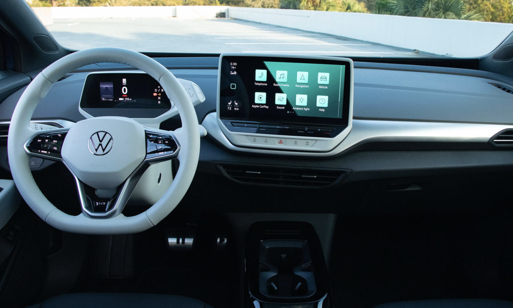
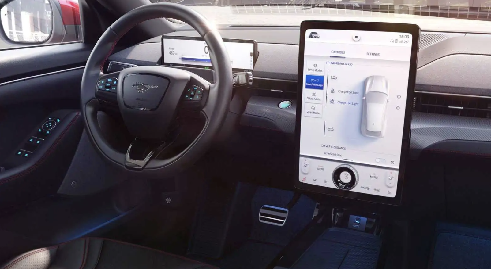
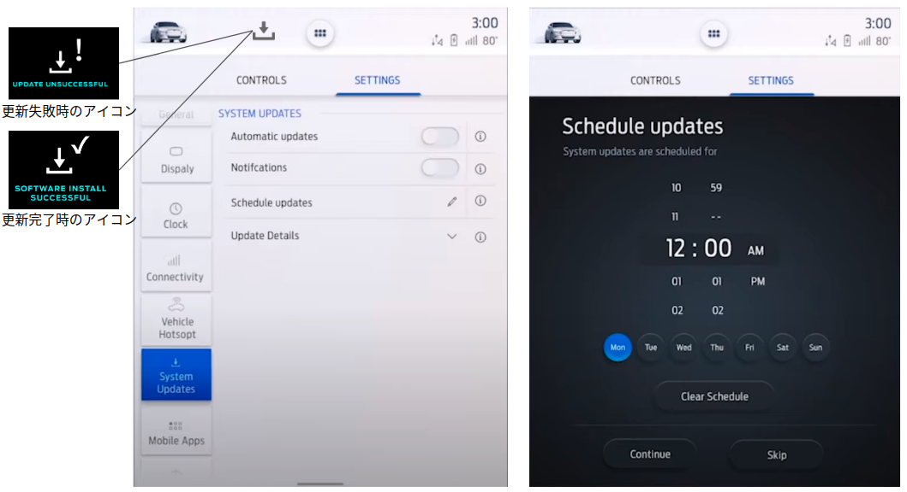
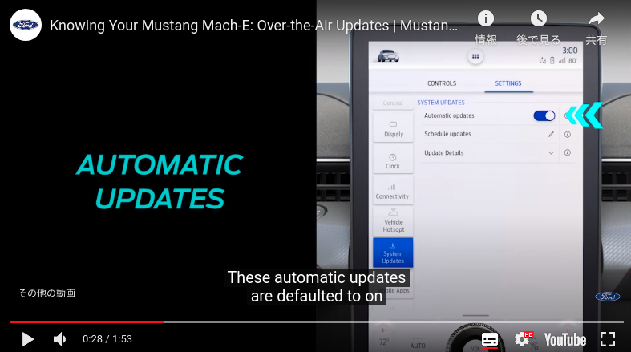
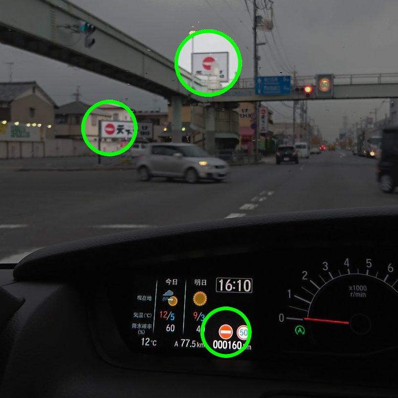

# ADAS / Software Update Trend

<!-- @import "[TOC]" {cmd="toc" depthFrom=1 depthTo=6 orderedList=false} -->

# 2021/06/27

## Tesla : オートシフトを導入

Auto-Shiftとは？
パーキング入っていてシートベルトを装着すると**最初のシフト操作**をTeslaが自動で入れてくれる機能。

どうやって判断しているのか？
障害物検知と、駐車直前の操作からD/Rのシフトが判断されるとのこと。基本的には、Dで駐車したらRに、Rで駐車したらDにシフトが入るようです。
ドライバが手動で操作する場合は、センタスクリーンの運転席側の端にある車両マークを↑にスライドでD、下にスライドでRにシフトが入るようになる。Pはブレーキを踏んで完全停止したら自動で入る。

このオートシフトに慣れてくると普通のクルマのシフト操作が面倒になってくるとのこと。感覚は人それぞれかもしれないが、人間の慣れは非常に大きいので今後広まるかもしれないですね。

> 参考：
> - [【テスラ モデルS PLAID】オーナーからの感想！　オートシフト！ ヨークステアリングホイール！ 感想動画がいっぱい！　TESLALOHAぐたぐた日本語TESLAニュース Vol.93 - YouTube](https://www.youtube.com/watch?v=WZrhp31NICc)
> - [【動画】シフトレバーがないテスラの新型Model S、タッチスクリーンでのシフト操作方法 - Engadget 日本版](https://japanese.engadget.com/tesla-model-s-refresh-touch-shift-113001507.html?guccounter=1&guce_referrer=aHR0cHM6Ly93d3cuZ29vZ2xlLmNvbS8&guce_referrer_sig=AQAAALCdf6xa3Zhv0X-8LOzhFlucCyaYlbaSpJ4oozhRG4376A85crXSRnqmwq2fa0uVoqyIGkrEitYDyXMpQeXTqsByW6wNgBt9WLQRkjjQn8AvpeRtDvRMeQ18SDDMPmVC4xZYehjSQ0MtoQkQGP_GyJT50k6q_j4H4v45BBPWlsnB)

# 2021/05/26

## Tesla : レーダーを排除しカメラ

# 2021/04/23

## Tesla : Model3のOTA更新機能について【最新版】

ソフトウェアバージョンVer2021.4.11/Ver2021.4.21へのアップデート詳細をYoutubeに動画を上げてくれている方がいたので、そこから得られた情報をまとめます。

- 【**重要!!**】プレミアムコネクティビティ契約(車載LTE通信)していてもOTAソフトウェア更新にはWifi接続が必要になるとのこと。
> 個人の感想：車載LTEは他のコネクティッドサービスには使えるけど、OTAには使えないのは通信費用との兼ね合いなのかもしれません。

- ダウンロード時間：10分程度 (更新ソフトVer2021.4.21)
- インストール時間：20~25分程度（この間車両は使えない）
- ダウンロード中は車両操作可能。
- セントリーモード（駐車中の監視録画モード）ではインストールできないので、OFFにする必要がある。モードONの時はインストール開始時に警告あり。
- ダウンロード完了後ユーザーのインストール許諾でインストール開始
- インストール許諾してから2分のカウントダウンがありインストールが開始される
　（この間なら更新キャンセルが可能です。一度インストール開始されるとキャンセル不可）
- カウントダウン画面を数回タップするとカウントダウンを省略できる。
- インストール中は車両操作不可
　センターコンソール画面が以下のようなインストール中画面になります。
　（「完了するまで運転禁止との表示」がでます。）
- インストール中も車載器は操作できないがスマホからは操作できるようです。
  (エアコン操作など)  
- インストール中の進捗はセンターコンソールではプログレスバーのみ、スマホアプリ側では進捗パーセンテージが数字で表示される

> 参考：
> - [初めてソフトウェアアップデートが来ました！ テスラ モデル3 SR+ 2021年モデル【Tesla model3】 - YouTube](https://www.youtube.com/watch?v=50qR1rwioLE)
> - [【テスラモデル3】最新アップデート2021.4.11の内容がめっちゃいい！！ - YouTube](https://www.youtube.com/watch?v=lcbnKuVBCfk)

# 2021/04/17

## Toyota : MIRAIアドバンスドドライブ試乗レポート（五味さん）

作成中

https://www.youtube.com/watch?v=KXIqnhZXuGY

## Other : 各社ハンズオフ制御名称

作成中

|OEM|System name|Target|Year|
|---|---|---|---|
|Ford | Blue Cruise | F-150/Mach-E | 2021~ |
|GM   | Super Cruise | -- | -- |

## Ford : 2021年秋頃にハンズオフ機能(BlueCruise)をOTAで機能追加することを発表

Fordは2021年7~9月に、ハンズオフ機能（BlueCruise）をF-150とMastabg Mach-Eの2車種にOTA機能アップデートで提供することを発表した。ここで重要なのは、このシステムを利用するには<u> **$600/3年間** のサブスクリプション料金を支払う必要がある</u>ことだ。

おそらくこのサブスク料金は地図更新用の費用ということだろう。OTA地図更新により適用範囲が拡大されていくと予想される。

■ Bluse Cruise (Hands-free Highway Driving)
- 対象車両
  - **F-150** : $995のCo-Pilot360 Active2.0パッケージ搭載車両
　　　　 （Lariat, King Ranch, Platinum trimsのグレードには標準装備）
  - **Mastang Mach-E** : $2,600のComfort and Technologyパッケージ搭載車両
  　　　 （CA Route1, Premium, First Edition trimsのグレードには標準装備）
 
- ドラモニカメラやレーダーなどのセンサは生産工場での搭載が必要で、後付はできない
- 2022年以降は、ハンズオフ機能が搭載したソフトウェアで生産される
- 対象範囲は、地図で規定された110,000マイル(117,027km)の区間となる。
- ドライバーモニタリングカメラでドライバの視線を監視する（サングラスOK）

> 参考：
> - [Ford’s hands-free answer to GM’s Super Cruise is called BlueCruise | Ars Technica](https://arstechnica.com/cars/2021/04/ford-will-roll-out-bluecruise-hands-free-driving-software-in-q3-2021/)

# 2021/04/11 

## Tesla : $2Kで加速度を向上させる課金サービスを提供

Teslaは、\$2,000で0-60mphまでの加速を4.8s→4.2sに向上させる課金サービスを提供。
こんな加速を向上させるだけの機能で\$2,000もとるのか…。

> 参考：
> - [Tesla Improves Model 3 LR, $2K Acceleration Boost Now Hits 60 in 3.7s](https://www.tesmanian.com/blogs/tesmanian-blog/tesla-improves-its-model-3-lr-2k-acceleration-boost-performance-to-3-7-seconds)
> - [Twitter](https://twitter.com/tesla_utah/status/1378376523971928067/photo/1)

# 2021/04/08

## Geely : ガソリン車でのOTA更新を実装

Geelyは、第18回広州国際モーターショーでXingruiモデルの最初のFOTA更新計画を発表し、OTAを達成した業界初のガソリン車であることを発表しました。

- 2020/12/31以前に購入したユーザーに対して1年間無料のOTAアップグレードを提供
- OTA更新対象: 6領域
  - Power domain
  - chassis domain
  - body domain
  - **ADAS domain**
  - connectivity domain
  - infortainment domain
- Ver1.0の更新内容
  - RPAリモート自動駐車機能
  - 540°パノラマ画像機能とNVH性能を最適化
- 更新時間は30分
- 更新タイミングは予約可能
- 地図更新（Baidu Mapを利用）

> 参考
> - [Geely becomes first automaker to implement OTA upgrades for gasoline vehicles - CnTechPost](https://cntechpost.com/2020/11/22/geely-announces-ota-upgrades-for-its-car/)
> - [Over the Air, Into Your Car : Media Center – Zhejiang Geely Holding Group](http://zgh.com/media-center/story/over-the-air-into-your-car/?lang=en)

## NIO : FOTA 差分更新をサポート

NIOはVer.2.8.0のソフトから更新が必要な箇所だけを更新するOTA方式を採用していると発表。これまでは全コードを書き換えていたことから、差分更新を導入したと考えられる。

- 現ソフトと新ソフトを自動的に比較し、更新パッケージサイズを算出
- インクリメント更新パッケージをダウンロードして更新する（おそらく差分更新のこと）
- 全書き換えだと2~3BGだが、約半分に圧縮することが可能。
- 将来的にはさらにサイズ圧縮できる可能性があると示唆。

> Simply put, the implementation of incremental update technology makes FOTA more flexible. The vehicle can determine which code needs to be changed and perform a refresh accordingly, instead of refreshing all codes indiscriminately as in the past.

> 参考：
> - [NIO explains its improved OTA capability brought by NIO OS 2.8.0 - CnTechPost](https://cntechpost.com/2020/12/11/nio-explains-its-improved-ota-capability-brought-by-nio-os-2-8-0/)

# 2021/03/31

## VW : Microsoftと提携し自動運転開発を加速

フォルクスワーゲンはマイクロソフトと組み、「自社の自動運転車両テクノロジーを前進させる」と発表（2021年2月11日）。
VWとマイクロソフトはこの自動車用クラウドのため2018年に協業を始めましたが、今年後半に車両群のオペレーションをテストする計画を立てています。VWはID.4と2022年に発売されるID.6で新しいソフトウェアを使う予定です。

[フォルクスワーゲンがマイクロソフトと組んで自動運転開発で巻き返しを図る | EVsmartブログ](https://blog.evsmart.net/vw/volkswagen-microsoft-partner-to-develop-autonomous-driving-software/)

## マツダ： 販売店入庫による無償有線ソフト更新を提供

マツダは2021/2/19、既存モデルのユーザー向けに、制御プログラムの更新で商品性を向上するサービス「MAZDA SPIRIT UPGRADE」を開始した。
また、3/10にマツダMDI＆IT本部主査（山﨑氏）が今後のOTA更新についても公演していることから、近いうちにOTAを導入していくと見られ、今回の有線リプロはその布石と見られている。

- 2/19より**無償で**サービスを提供
- 対象のユーザーは最寄りの販売店で制御プログラムの**有線更新**を行う
- 対象車両：マツダ3 と CX-30　の初期モデル
- 更新内容
  - パワトレ：　
    - エンジンとATの制御ソフト（アクセルレスポンス/コントロール性能向上）
  - 運転支援システム：　
    - ACC+LTA搭載車（作動速度上限を55km/h→高速域まで引き上げ）
    - ACC（追従時の加減速フィーリング向上）

> 参考：
> - [MAZDA NEWSROOMマツダ、商品性向上を目的とした制御プログラムなどの最新化サービス開始｜ニュースリリース](https://newsroom.mazda.com/ja/publicity/release/2021/202102/210219a.html)
> - [購入後の車両がソフトウェア更新で性能向上、マツダが2車種で提供開始：車載ソフトウェア - MONOist](https://monoist.atmarkit.co.jp/mn/articles/2102/22/news056.html)
> - [自動運転時代を影で支えるセキュリティとOTAでリードするマツダ…ReVisionモビリティサミット2021 | レスポンス（Response.jp）](https://response.jp/article/2021/03/11/343878.html)

## BMW: iDrive8からADAS機能OTA可能に

- iDrive8搭載予定車両 (EV)

|車種|販売時期|日本導入時期|備考|サイトリンク|
|--|--|--|--|--|
|[i4](https://www.bmw.co.jp/ja/all-models/bmw-i/i4/2021/bmw-i4-preview.html)|2022|2022年春以降| EV-グランクーペ | [[*1]](https://online-store.bmw.co.jp/#/pre-book/93/106) |
|[iX](https://www.bmw.co.jp/ja/all-models/bmw-i/bmw-ix-new/2020/Highlights.html)|US: 2021|2021年以降| EV-SUV | [[*2]](https://online-store.bmw.co.jp/#/pre-book/93/95?vc=Qk1XMTYwNzkwNTEwMDgzMg%3D%3D) [[*3]](https://www.jdpower.com/cars/new-car-previews/2022-bmw-ix-preview?make=bmw&model=ix) |

- OTA [[*4]](https://www.jdpower.com/automotive-news/electric-bmw-suv-first-of-many-ultimate-driving-evs?make=bmw&model=) [[*5]](https://www.jdpower.com/cars/shopping-guides/what-is-bmw-idrive-8) [[*6]](https://response.jp/article/2021/01/18/342225.html) [[Youtube-BMW公式]](https://youtu.be/M5U1Fb_Z7Zs?t=602)
  - 5G対応
  - 追加購入 or Short-termサブスクによる追加機能を提供予定
  - ADAS機能などのソフトウェア更新が可能
  - 車載Ethernet : Max30Gbit 
  - 20分未満でのOTA更新 

- iDrive8
  - BMW IDによるパーソナライズ機能
    - 車載器のあらゆる設定を一括管理
    - 車両を変えてもIDに紐付いて引き継ぎが可能
  - デジタルキー・プラス
    - iPhoneのバッテリー残量が低下しても最大5時間キーとして利用可能(=パワーリザーブ機能)
    - iMessage経由で最大5人とデジタルキーの共有可能
    - Apple Watchとの連携可能
    - iPhone U1チップ搭載の[UWB技術](https://news.mynavi.jp/article/20190912-smartphone_word/#:~:text=UWB%E3%81%A8%E3%81%AF%E3%80%8CUltra%20Wide,%E5%B0%91%E3%81%AA%E3%81%84%E3%81%93%E3%81%A8%E3%81%8C%E7%89%B9%E5%BE%B4%E3%81%A7%E3%81%99%E3%80%82)でリレーアタックが不可能に（セキュリティ強化）
  - 3つのDriving-Mode
  ※OTAでモードが追加される可能性がある
    ||||
    |--|--|--|
    |1|Efficient|エネルギー効率重視のモード|
    |2|Sport|加速感とハンドリング重視のモード|
    |3|Personal|個人のカスタマイズ可能なモード|
  - センターコンソール（HMI）操作などについては以下の動画がわかりやすい
    - [【YouTube】World Premiere of the all-new BMW iDrive | March 15, 2021](https://www.youtube.com/watch?v=M7XijeIorQc)

- 自動運転機能(ADAS)
  
  BMWは、iXで将来的に自動運転機能をサポートする準備ができていることを示唆している。
  
  > The company did explain that the iX offers 20 times the computing speed of a current BMW and that it is ready to support the automated driving technologies of the future. 
  > 出典：[2022 BMW iX Preview](https://www.jdpower.com/cars/new-car-previews/2022-bmw-ix-preview?make=bmw&model=ix)

  

  (i4,iXの車両外観図　左：iX, 右：i4)

> 参考：
> - [Electric BMW SUV First of Many Ultimate Driving EVs](https://www.jdpower.com/automotive-news/electric-bmw-suv-first-of-many-ultimate-driving-evs?make=bmw&model=)
> - [What is BMW iDrive 8?](https://www.jdpower.com/cars/shopping-guides/what-is-bmw-idrive-8)

# 2021/3/16

## Tesla FSDは買替えで引き継げない

"テスカス"というTeslaに関する国内の情報サイト(個人サイト)があり、その中にFSDの引き継ぎに関するコメントがありました。この[コメント](https://teskas.net/forums/topic/42159/#post-42218)が投稿された(2021/2/21)時点では、新車購入してもFSDは引き継げないので再度オプション購入する必要があるようです。つまり、FSDオプションはTeslaアカウントではなく、VINに紐づいているということになります（公式情報ではないので信頼性は低いですが…）。

また、こちらの[コメント](https://teskas.net/forums/topic/42159/#post-42229)(2021/2/22)では、テスラの下取りではFSDは査定に加味されないようです。

> 参考：
> - [既存モデル3オーナー、新型への買い替え雑談場所 | テスカス](https://teskas.net/forums/topic/42159/)

## Tesla china : FSD付き車両の買い替えで次回FSD半額

上記同様、"テスカス"情報ですが今回は出典がついているので信用できる情報と思います(2021/1/1の記事)。

テスラチャイナはFSD付き車両からモデルS3Xのいずれかに買い換える場合、次の車両のFSDを半額で購入できるプランを提示しました。
テスラが販売しているFSD（完全自動運転オプション）はオーナーのアカウントではなく車両に紐づいているため、買い換えるとFSDの権利はなくなってしまいます。
高額なオプションであるが故に買い替えの足枷となっていることは間違いなく、今回の取り組みでそれを解消しようとしているようです。

中国では他にも以下のような特典を用意。

- 15,000km分スーパーチャージャー無料
- ウォールコネクター無料クーポン
- 年次検査無料
- 2年間の延長保証20％オフ

> 参考：
> - [テスラ中国、FSD半額で購入可能へ。 | テスカス](https://teskas.net/forums/topic/40996/)
> - [Tesla China offering FSD at half price, other incentives in new trade-in offer - Drive Tesla Canada](https://driveteslacanada.ca/news/tesla-china-trade-in-fsd-discount/)

# 2021/3/8

## 自動運転Lv3の動向

現在の各社の動向が簡単にまとまっており見やすい。

[自動運転レベル3の定義や開発状況まとめ　ホンダが2021年3月に車両発売 | 自動運転ラボ](https://jidounten-lab.com/y_1679)

## VW ID.3/ID.4 : OTAソフトウェア更新を今夏から欧州で開始

VWはID.3/ID.4の全車に対して今夏から欧州でOTAを開始することを発表。
現在VW社内でOTAテストを約3000台規模で実施中とのこと。

- 通信方式：Wifi or モバイルネットワーク(おそらく4G回線)
- 更新内容：機能向上・機能追加・ソフトパフォーマンス最適化・カスタマイズオプション設定

 

> 参考：
> - [VWの新型EV「ID.」シリーズ、初の無線ソフト更新…今夏から欧州で | レスポンス（Response.jp）](https://response.jp/article/2021/03/05/343700.html)
> - [Volkswagen ID.4 Already Gets Its First Major Software Upgrade | CarBuzz](https://carbuzz.com/news/volkswagen-id-4-already-gets-its-first-major-software-upgrade)

## Ford Mustang Mach-E : 一部所有者限定でOTAベータ配信の実施

FordはMustang Mach-Eの所有者に対して、OTAソフトウェア更新のβテストを実施。対象者は[MachEForum](https://www.macheforum.com/site/threads/ford-offers-early-ota-updates-for-select-survey-respondents.4088/)に参加しており、秘密保持契約(NDA)に契約を同意した人に限られるそうです。DNAが守られている限りOTAの詳細は未知のままになりますが、近いうちにFordもOTAソフトウェア更新を市場で導入してくると思われます。
ちなみにデータテストの参加者はAmazonギフト券$20がもらえるようです。

 

> 参考：
> - [Ford Beta Testing Mustang Mach E OTA Updates | AutoVerdict](https://www.autoverdict.com/ford/ford-beta-testing-mustang-mach-e-ota-updates/)
> - [Ford Starts Beta Testing Mustang Mach-E Over-The-Air Software Updates](https://insideevs.com/news/492416/ford-mustang-mache-testing-ota-software-updates/)

## Audiのビッグデータ活用：路面状態から警告を行う

AudiはV2Xの仕組みを活用して、車両挙動から路面摩擦係数を推定し「Local hazrd alerts」サービスを提供している。氷のはった滑りやすい路面に差し掛かる前に、リアルタイムでドライバに注意喚起を行う。
NIRAは2018年から車両情報から道路状態を予測するサービスを提供していたが、Audi/HEREと連携を始めたことでサービスがより展開された事になる。

- 約170万台の収集データを活用
- 路面の摩擦係数を推定し路面状態から事前に注意喚起
- スウェーデンの[NIRA Dynamics AB](https://niradynamics.se/)及び[HERE Technologies](https://www.here.com/)(BMW, Daimler, Audiが所有する地図会社)との共同サービスとなる。

> 参考：
> - [Precise data for greater safety: Audi warns its drivers about slippery roads](https://www.volkswagenag.com/en/news/2021/03/precise-data-for-greater-safety--audi-warns-its-drivers-about-sl.html)
> - [NIRA DynamicsとKlimatorが提携を強化　自動車の摩擦データで道路天候モデルを向上 | NIRA Dynamics ABのプレスリリース | 共同通信PRワイヤー](https://kyodonewsprwire.jp/release/201802050662)

# 2021/2/19

## Bosch, Microsoft が共同でOTA-SUプラットフォームを開発

AzureのクラウドサービスとBoshの各種ソフトウェアモジュールをベースにOTA-SUプラットフォームのか開発を開始するとのこと。2021年末までにプロトタイプを作成予定。
また、両社はGitHubを利用して自動車業界共通のOSS(Open Source Sofrware)化も計画をしている。

もし車載機のOTA技術がOSS化されてば、よりロバストネスなプラットフォームが作られることになると思います。ものによりますが、自社で技術を隠し持つよりも世界中のエンジニアに揉まれたOSSの方が有用なプログラムに成熟するとと考え方が変わってきています。

> 参考：
> - [マイクロソフトとボッシュ、自動車向けソフト定義基盤を開発へ--スマホのように車を更新 - CNET Japan](https://japan.cnet.com/article/35166755/)
> [Microsoft and Bosch join forces to create new automotive software platform - Roadshow](https://www.cnet.com/roadshow/news/microsoft-and-bosch-join-forces-to-create-new-automotive-software-platform/)

## Mercedes：130万車両のリコールをSU対応（SOS機能）

事故発生時に救急要請を行う「自動eCallシステム」において、事故発生時の場所ではなく最後にIG-ONした場所の位置データを送信してしまう不具合が発覚。ただし、SOSボタンを手動で操作した場合は、正常に作動するとのこと。

- 問題
  - 通信モジュールのソフトウェア設計に問題あり
  （衝突の影響で通信モジュールへの電力供給が寸断されると、位置情報が最後のIG-ON位置として送信される。おそらくバッファとして残してあるデータがそのまま送信される。）
- 対応方法
  - OTAリプロ
  - 販売店でのリプロ

> 参考：
> - [Mercedes-Benz to fix nearly 1.3M recalled vehicles with software update](https://www.thecarconnection.com/news/1131287_mercedes-benz-to-fix-nearly-1-3m-recalled-vehicles-with-software-update)
> - [ダイムラー、米でメルセデス・ベンツ129万台リコール　ソフトに問題 | Reuters](https://jp.reuters.com/article/mercedes-benz-recall-idJPKBN2AF09R)

# 2021/2/17

## Ford Mustang MACH-EのOTAシステム/HMI

- 車載通信モジュール or Wifi
- 自動OTA更新機能あり
- 走行中にも可能な更新もあれば停止中しか更新できないものもある
- 更新タイミングのスケジューリング設定が可能
- 次回IG-ONでインストール完了通知
- 更新アイコンをタッチすると詳細画面に遷移

Youtube

> 参考：
> - [Watch the Ford Mustang Mach-E battle against gravity, lightning, and a freaking rocket - SlashGear](https://www.slashgear.com/watch-the-ford-mustang-mach-e-battle-against-gravity-lightning-and-a-freaking-rocket-12659173/)
> - [Knowing Your Mustang Mach-E: Over-the-Air Updates | Mustang Mach-E | Ford - YouTube](https://www.youtube.com/watch?v=XlmgNed_0qo&feature=emb_logo)

## 「天下一品」誤認識問題とOTA技術への期待

以前、ホンダセンシングの標識認識で、「天下一品」看板を「進入禁止」標識と誤認識してしまう問題が話題になった。また、2020年2月のMcAfeeのADASハッキング調査で、標識に簡単なステッカーを貼ることで、「一時停止」を「追加車線」の標識に誤認識させたり、速度制限の数値を誤認識させたりすることができると公表した（調査車両：2016年製 Tesla車両 Mobileye-Camera）。

このような、ADASの外的要因による誤認識やハッキングは、致命的な被害を及ぼす可能性があり、迅速な対応が必要になる。そうした対応にOTA技術が活きてくると、世の中ではOTAへの期待がされている。

※出典:[HONDAの人工知能は車種によって“天下一品ラーメン”のマークと“進入禁止”の標識を見分けられない！？→実際に天下一品に近づいてみた結果 - Togetter](https://togetter.com/li/1266643)

> 参考：
> - [「天下一品」誤認識問題、「OTA」が解決の鍵！自動運転時代の必須技術 | 自動運転ラボ](https://jidounten-lab.com/u_tenka-honda-ota)
> - [hondasensing.pdf](https://www.honda.co.jp/hondasensing/common/pdf/hondasensing.pdf)
>>>>>>> 9a1f47ec29ac8aa5d120e286918ec3d249a21048

# 2021/2/4

## 韓国発の物体認識ソフト「SVNet」が世界880万車両で採用

[SVNet](https://stradvision.com/ja/products-ja/)とは、韓国のSTRADVISION社が開発しているDNNベースの物体認識ソフトです。MobileEyeに並び、最近注目度が高い認識ソフトになります。

STRADVISION社は今年2月2日までに、国際的な情報セキュリティ認証「ISO 27001:2013（ISMS）」を取得したことを発表し、SVNetの信頼性も向上したと言えます。

<u>特徴</u>
- 軽量なネットワーク（パラメータ数2M以下）
- 組み込み向け
- 精度：Faster-RCNN(VGG)*1と同等レベル ([>>認識サンプル動画](https://stradvision.com/ja/svnet-external-ja/))
  →COCO DatasetのmAP(認識精度指標)が26%なので非常によい認識性能というわけではなさそう。

> 軽くてある程度の認識精度は出せることが売りの模様

*1 ... Microsoftが2015年に発明したE2EのDNN物体認識アルゴリズム

> 参考：
> - [Products JA - StradVision](https://stradvision.com/ja/products-ja/)
> - [世界880万台で導入へ！韓国StradVisionの自動運転向け物体認識ソフト | 自動運転ラボ](https://jidounten-lab.com/u_stradvision-880)

# 2021/1/31

## Tesla Model-S/X の内装を一新（'21/4 LO予定）

- Model-S
  - 新たにPlaidグレードが追加された
  - ハンドルがU字型に変更
  - モーター3つ搭載（AWS、1020馬力）
  - 0~60mph(約95km/h)を2.0s以下で加速
  - PS5並の性能を持つゲーム環境（Witcher3などのタイトルが利用可能）
  - フル充電で約836kmの走行が可能（Plaid+グレード）
  - 最高速度：200mph(約322km/h)

※2021/1/31 時点の自動運転機能 (o: 利用可能機能)

|自動運転機能|NA|JP|CN
|--|--|--|--|
Auto pilot (標準装備)|o|o|o
Autopark|o|o|o
Navigate on Autopilot|o|Upcomming|o
Auto Lane Change|o|Upcomming|o
Summon|o|Upcomming|o
Traffic Light and Stop Sign Control|o|Upcomming|Upcomming
Autosteer on city streets|Upcomming|Upcomming|Upcomming

> 参考：
> - [テスラ、新型Model S / Xを公開。U字型ハンドル採用、PS5級のゲーム性能も？ - Engadget 日本版](https://japanese.engadget.com/tesla-new-model-s-x-steering-yoke-high-performance-gaming-090029491.html)
> - [Electric Cars, Solar & Clean Energy | Tesla](https://www.tesla.com/?redirect=no)

# 2021/1/27

## Tesla FSDをサブスク化することを発表

Elon Muskは、2020年第1四半期の決算説明会（2020/4/30）でFSDをサブスクリプション化することを発言し、Twitter（2020/12/20）にて2021年にサブスクリプション化することを発言しています。詳細については余り触れられていないですが、電話会議の中でCFOのKirkhorn氏が以下のように発言していることから、"Electrek"は、現状のFSD価格設定で考えると100/月（¥10,000/月）以下の販売となる可能性があると示唆していました。
> “Agree. And financially, rolling the upfront purchase of the FSD option into a loan in the vehicle or a lease will be the least expensive plan on a monthly basis to own, plus you preserve the option value of increased value over time.”

> 参考：
> - [Tesla confirms self-driving as a subscription service but brace yourself for the price - Electrek](https://electrek.co/2020/04/30/tesla-self-driving-subscription-service-price/)
> - [テスラの『完全自動運転オプション』月額払いで利用可能に - Engadget 日本版](https://japanese.engadget.com/tesla-fsd-040002017.html)

## その他

- 2021.1.24: [いすゞが「ＣＡＳＥ」に1000億円！ボルボと連携で投資効率高める｜ニュースイッチ by 日刊工業新聞社](https://newswitch.jp/p/25619)
- 2020.7.30: [恐るべき価格破壊力で注目！ 激安アジアタイヤを買ってはダメなのか](https://bestcarweb.jp/news/177951)

# 2021/1/26

## ExcelforeのOTAの技術

SUZUKI、FORD、ZF、BMW、NISSAN、Panasonicと関連があるが詳細はしらべきれていない

[ExcelforeがOTAのExcelfore Docker ソルーションを日本で販売開始 | 朝日新聞デジタル＆M（アンド・エム）](https://www.asahi.com/and_M/pressrelease/pre_22358080/)
[Excelfore :: Smart Mobility Networks](https://excelfore.com/)

## Honda：GMと国内で自動運転モビリティサービス実証実験開始

2021年内にGMのBoltをベースとした自動運転車両を利用し、国内での自動運転技術の実証実験を行うことを発表。将来的には、クルーズ、GM、Hondaの3社が共同開発している自動運転モビリティサービス事業専用車両である「クルーズ・オリジン」を活用した事業展開（無人ライドシェアサービス）を目指すとのこと。

> 参考：
> - [Honda | Hondaがクルーズ・GMと、日本での自動運転モビリティサービス事業に向けた協業を行うことで基本合意](https://www.honda.co.jp/news/2021/c210120.html)
> - [ホンダ、GMと年内に日本で自動運転の実証実験: 日本経済新聞](https://www.nikkei.com/article/DGXZQODZ2011T0Q1A120C2000000)

# 2021/1/19

## Mercedes MM系課金パッケージ

[Mercedes me Store](https://shop.mercedes-benz.com/ja-jp/connect/)で機能毎に個別購入が可能。
ただし、車両によって無料期間が設定されている([こちら参照](http://www.mercedes-me-connect.jp/shashu.html))。

|サービス|期間|価格(円)|
|--|--|--
|リモートパーキングアシスト         |1年|  7,500|
|リモートサービス/車両設定          |1年|  5,300|
|車両モニタリング                   |1年|  5,300|
|24時間コンシェルジュサービス       |1年| 20,200|
|ナビゲーション・サービス (MBUX車両)|1年|  7,800|
|リモートエンジンスタート           |1年|  7,800|
|リモートセットアップ(PHV)          |1年|  3,400|
|Apple CarPlayTM / Android AutoTM   |-  | 30,000|
|ナビゲーション機能                 |-  | 66,000|
|テレビ機能                         |-  |119,000|

補足
- [★購入/アクティベート方法](http://www.mercedes-me-connect.jp/store.html)
- 決済はクレカのみ
- 決済完了後の解約・取り消し不可
- クーリングオフは適用外

> 参考：
> - [ホームページ | Mercedes me connect - Japan](https://shop.mercedes-benz.com/ja-jp/connect/)
> - [Mercedes me connect](https://www.mercedes-benz.co.jp/passengercars/being-an-owner/mercedes-me-connect/mercedes-me-connect-use-period.module.html)

## Tesla MUC欠陥で15.8万台リコール要請

NHTSAはTeslaに対して、タッチスクリーン操作に不具合をきたすMCU欠陥を理由に15.8万台のリコールを要請（'21/1/13）。

**MUC欠陥内容**
- 箇所：8GBのeMMC NANDフラッシュメモリー
- 影響：各種機能の設定不可、アラームの停止など
- 内容：P/Eサイクル$^{*1}$約3000回で寿命となり、メモリ不足に陥った（NHTSA判断）

このMUC問題は昨年から指摘されており、TeslaはOTAでの対応を試みたが、NHTSAは不十分と判断して、今回のリコール要請にいたる。

*1: 書き込み消去回数

> 参考：
> - [テスラ車15.8万台に米政府がリコール要請、タッチスクリーンに不具合 | TechCrunch Japan](https://jp.techcrunch.com/2021/01/14/2021-01-13-feds-asks-tesla-to-recall-158000-vehicles-over-failing-touchscreen-displays/?guccounter=1&guce_referrer=aHR0cHM6Ly93d3cuZ29vZ2xlLmNvbS8&guce_referrer_sig=AQAAADney0bhGTGcIKJZORCw2tvgoHJeUXOb2U7zUw99ewlWpSlGQWayxO-Rld6ERKrwMON2R7qnxxel-tOtTzHjo0zbKQDkzxPrw_Pw986a-3euxtBUH04Q23XjRXnlrGtKk2z6tA_zZ0rTXGn5P2lI30jkZjvf71oFVBttZGVl84Rp)
> - [米当局、テスラにリコール要請　運転支援機能に不具合: 日本経済新聞](https://www.nikkei.com/article/DGXZQOGN14F7T0U1A110C2000000)

# 2021/1/18

## NIO et7を発表

バッテリーパックごと交換する『パワースワップステーション』の設置を、現在177カ所→2021年末までに500カ所にするとしています。さらに「車両が自動でステーションに入り、ユーザーは中央のディスプレイを1回タップするだけで、車両から降りることなくセルフサービススワップを開始できる」という『PowerSwap Station 2.0』を展開することも表明。

**自動運転機能の性能比較**

Items|NIO|Tesla
--|--|--
対象車両|ET7|Model-S|
販売年|2022予定|2021現在|
自動運転機能価格|約11,000円/月(サブスク売り)|871,000円(オプション)|
自動運転用SoC|Nvidia Drive Orion|Tesla SFD Soc|
処理能力| 1016TOPS | 144TOPS
Frカメラ解像度| 8Mp | 1.2Mp 
車両認識距離 | 約687m | 約250m

※約80ヶ月利用するとTeslaのFSDの価格を上回ることになる。ただし、納車後の一定期間は無料期間が設定されるのではないかと予想。

> 参考：
> 1. [中国版テスラ「ニーオ」、高性能EVセダン発表…航続は1000km以上 | レスポンス](https://response.jp/article/2021/01/13/342070.html)
> 1. [NIO - NAD](https://www.nio.com/nad)
> 1. [「驚くほど単純」、半導体メーカーの常識超えるTesla製AIコア | 日経クロステック（xTECH）](https://xtech.nikkei.com/atcl/nxt/column/18/00001/04390/)
> 1. [Triple Forward Camera from Tesla Model 3 - System Plus Consulting](https://www.systemplus.fr/reverse-costing-reports/triple-forward-camera-from-tesla-model-3/)

## 日産 アリアにOTAを導入

メモリ2面持ちの「デュアルバンクメモリ」を採用し、走行中のSU可能。
自動運転Lv3の提供は行わない方針。

**OTAで変更可能な内容例：**
- ドライブモードの追加(乗り味の変更)
- ナビゲーションシステムの更新
- ユーザーインタフェースのアップグレード
- 地域ごとのニーズを踏まえたコネクテッド機能　など

> 参考：
> 1. [【日産 アリア】コネクテッドにはアマゾンのAlexaも搭載、シームレスなつながり追求 | レスポンス（Response.jp）](https://response.jp/article/2020/07/16/336634.html)
> 1. [自動車に「ソフトウェアファースト」がもたらす競争力を考える (2/3) - MONOist（モノイスト）](https://monoist.atmarkit.co.jp/mn/articles/2101/13/news056_2.html)

## Mack TrucksがOTAを導入

Mack Trucksはアメリカのトラックメーカーで、1/12週にAnthem、Pinnacle、Graniteの3モデルにOTAが標準装備されることを発表（2021/1/15：記事）。最初の2年間無料で、その後はサブスクによって延長。  

**OTAで変更可能な内容例：**
- 最大走行速度
- アイドリングストップパラメータ
- mDRIVE(トランスミッション)のパラメータ　など

> 参考：
> 1. [Mack over-the-air updates now standard on Anthem, Pinnacle, Granite models | TheTrucker.com](https://www.thetrucker.com/trucking-news/equipment-tech/mack-over-the-air-updates-now-standard-on-anthem-pinnacle-granite-models)
> 1. [Mack OTA updates now standard with driver download activation](https://www.fleetequipmentmag.com/mack-ota-updates-standard-driver-download-activation/)

## Sony Vision-S

> [ソニー VISION-S、レベル2＋の自動運転技術を導入…CES 2021 | レスポンス（Response.jp）](https://response.jp/article/2021/01/14/342108.html)

