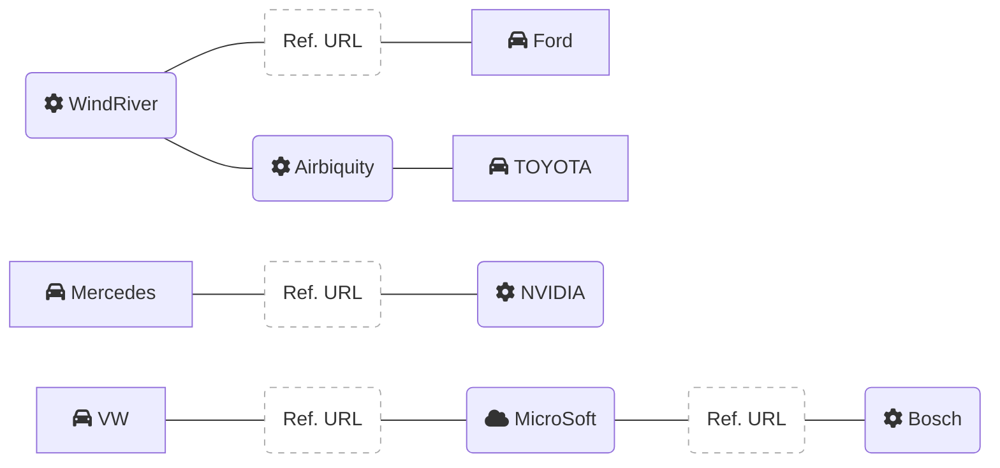

# OTA技術の各社相関図

 

- [Airbiquityがトヨタ自動車、デンソー、豊田通商、からの戦略的投資の受け入れを発表 :: Airbiquity](https://www.airbiquity.com/jp/news-press/press-releases/airbiquity)
- [ウインドリバーとAirbiquityが提携 | Airbiquityのプレスリリース | 共同通信PRワイヤー](https://kyodonewsprwire.jp/release/201906057175)

WindRiver
- [Wind River CarSync](https://cdn.windriver.com/japan/products/automotive/edge-sync/)
- [Ford Selects Wind River Over-the-Air Update Technology | Wind River](https://www.windriver.com/news/press/news-21606)
- [ウインドリバー、差分システム技術を搭載した「Edge Sync」の機能拡張を発表：フォードを含む大手自動車メーカーに供給 - TechFactory](https://techfactory.itmedia.co.jp/tf/articles/1811/28/news043.html#_ga=2.106457345.326697866.1617804165-1799664173.1605191265)

Airbiquity
- [Japanese :: Airbiquity](https://www.airbiquity.com/jp)

Mercedes
- [新型Sクラスがレベル3の自動運転に対応、2021年後半からドイツで利用可能に：自動運転技術（1/2 ページ） - MONOist](https://monoist.atmarkit.co.jp/mn/articles/2009/03/news049.html)

Toyota
- [トヨタ、遠隔ソフト更新で手放し自動運転機能を拡張　20年量産へ | 日経クロステック（xTECH）](https://xtech.nikkei.com/atcl/nxt/column/18/00001/03175/)
- [トヨタが新型LSで4つのLiDARを採用、高速道路出口まで運転支援：安全システム - MONOist](https://monoist.atmarkit.co.jp/mn/articles/2007/08/news051.html)

VW
- [Volkswagen ID.4 Already Gets Its First Major Software Upgrade | CarBuzz](https://carbuzz.com/news/volkswagen-id-4-already-gets-its-first-major-software-upgrade)

NIO
- [NIO explains its improved OTA capability brought by NIO OS 2.8.0 - CnTechPost](https://cntechpost.com/2020/12/11/nio-explains-its-improved-ota-capability-brought-by-nio-os-2-8-0/)

